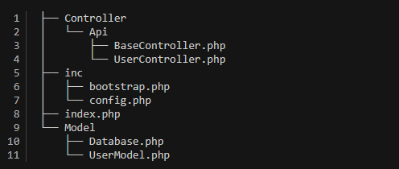

# API-REST project using PHP and MySQL

## Setting Up the Skeleton



- index.php: the entry-point of our application. It will act as a front-controller of our application.
- inc/config.php: holds the configuration information of our application. Mainly, it will hold the database credentials.
- inc/bootstrap.php: used to bootstrap our application by including the necessary files.
- Model/Database.php: the database access layer which will be used to interact with the underlying MySQL database.
- Model/UserModel.php: the User model file which implements the necessary methods to interact with the users table in the MySQL database.
- Controller/Api/BaseController.php: a base controller file which holds common utility methods.
- Controller/Api/UserController.php: the User controller file which holds the necessary application code to entertain REST API calls.

## Create a Database

I'm this case I am going to use phpMyAdmin.

Inside our new database called 'rest_api_demo' we create this table:

```sql
CREATE TABLE `users` (
  `user_id` bigint(20) UNSIGNED NOT NULL,
  `username` varchar(60) CHARACTER SET utf8mb4 COLLATE utf8mb4_unicode_ci NOT NULL DEFAULT '',
  `user_email` varchar(100) CHARACTER SET utf8 COLLATE utf8_unicode_ci NOT NULL DEFAULT '',
  `user_status` int(11) NOT NULL DEFAULT 0
) ENGINE=InnoDB DEFAULT CHARSET=utf8mb4 COLLATE=utf8mb4_general_ci;

```

We fill the 'users' table with some random information

```sql
INSERT INTO `users` (`user_id`, `username`, `user_email`, `user_status`) VALUES
(1, 'john_doe', 'john.doe@example.com', 1),
(2, 'jane_smith', 'jane.smith@example.com', 0),
(3, 'bob_jones', 'bob.jones@example.com', 1),
(4, 'alice_wonderland', 'alice.wonderland@example.com', 0),
(5, 'charlie_brown', 'charlie.brown@example.com', 1),
(6, 'emily_parker', 'emily.parker@example.com', 0),
(7, 'david_clark', 'david.clark@example.com', 1),
(8, 'sarah_white', 'sarah.white@example.com', 0),
(9, 'samuel_black', 'samuel.black@example.com', 1),
(10, 'olivia_green', 'olivia.green@example.com', 0);

```

## Copy the repository to obtain the Architecture with their files

## How to Call Our REST API

```php
// https://localhost/index.php/{MODULE_NAME}/{METHOD_NAME}?limit={LIMIT_VALUE}
localhost/index.php/user/list?limit=20

```
